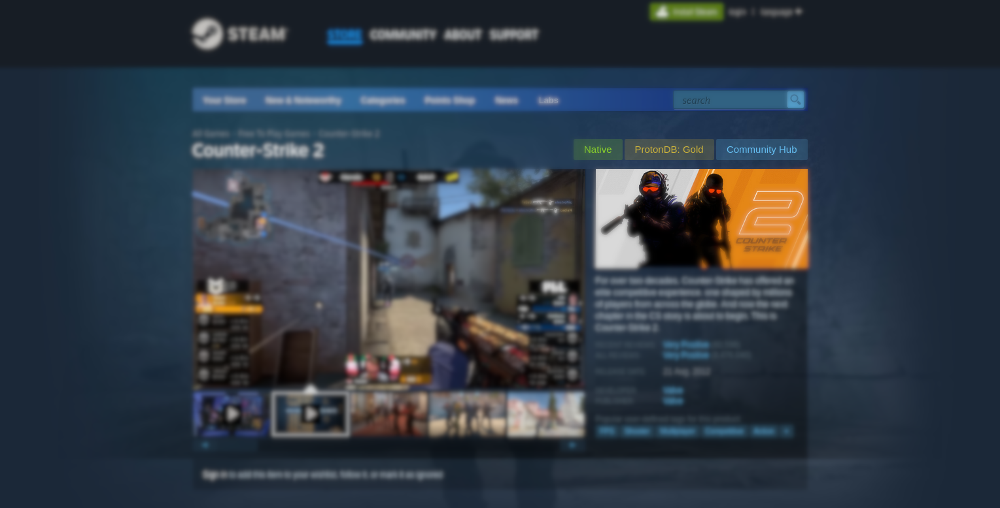

<h1 style="text-align:center;">Protonfox</h1>

Protonfox is an extension for <a href="https://firefox.com">Firefox</a> that displays <a href="https://protondb.com">ProtonDB</a> ratings on Steam.

  

---

### [🧩 Install for Firefox](https://addons.mozilla.org/en-US/firefox/addon/protonfox-for-steam/)

## 🚀 Building:
Requirements:
- [Node.js](https://nodejs.org) (recommended version: 22.x)
- [pnpm](https://pnpm.io/installation) package manager (recommended version: 9.x)

To build the extension:
- Run `pnpm install` to install dependencies.
- Run `pnpm run build` to build the extension.

## 📰 Credits:
- [MostwantedRBX/proton-chrome-extension](https://github.com/MostwantedRBX/proton-chrome-extension) - Original extension

This extension is not affiliated with ProtonDB and/or Valve Corporation.